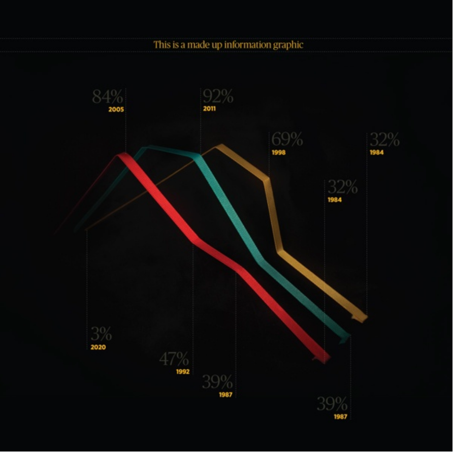
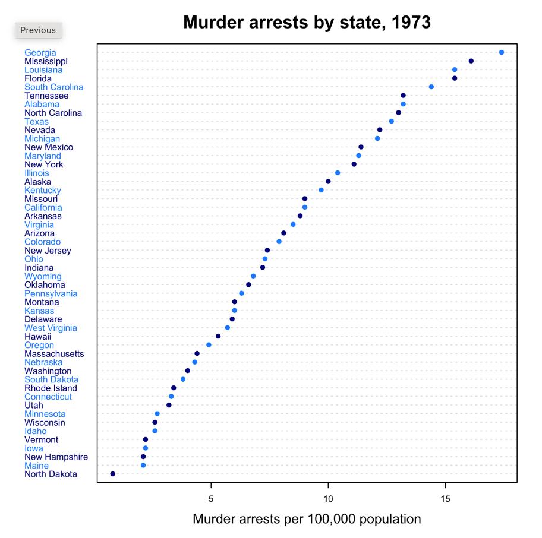

# Data Visualization

## Assignment 2: Good and Bad Data Visualization

### Requirements:

- Data visualizations are important tools for communication and convincing; we need to be able to evaluate the ways that data are presented in visual form to be critical consumers of information 
- To test your evaluation skills, locate two public data visualizations online, one good and one bad  
    - You can find data visualizations at https://public.tableau.com/app/discover or https://datavizproject.com/, or anywhere else you like! 
- For each visualization (good and bad):  
    - Explain (with reference to material covered up to date, along with readings and other scholarly sources, as needed) why you classified that visualization the way you did.
      
**Bad Visualization:**

*Accessed via: https://datavizproject.com/data-type/line-chart/*
   
- Explain (with reference to material covered up to date, along with readings and other scholarly sources, as needed) why you classified that visualization the way you did.  

I classified the above figure as being an example of a bad data visualization mainly because it does meet the “perceptual” quality of data visualization where the viewer is able to easily identify the message that the visualization is designed to covey. In this figure, the lines are shown in a 3D format that varies in width such that the lines almost disappear at higher yellow number values. This characteristic combined with the fact that the yellow number axis is shown at both the top and bottom of the figure makes it challenging to relate line values with their respective yellow number values. As well, the black background of the figure is very close in colour to the dark grey percentages associated with each yellow value making them almost impossible to see. Next, this figure lacks both axis labels and a legend describing what the different line colours represent. Without this information, the viewer is unable to ascertain what data patterns the figure is showing and why they might be important or significant. Finally, this figure lacks a data source meaning that the viewer has no way of verifying where the creator obtained the data and whether it is an accurate and unbiased representation of the trends contained within the dataset. In addition to affecting its “perceptual” quality, the characteristics I described also mean that this figure fails to meet any of the four conventions of data visualization outlined by Kennedy et al. (2016) that we discussed in class. From Kennedy et al.’s (2016) research, it is therefore likely that viewers of this figure would perceive it as being subjective and fictitious (which is technically true since it is a made-up infographic).
  
- How could this data visualization have been improved?  
      
To improve this data visualization, the creator would need to address the issues that I identified in my previous answer which could be done easily by transforming this figure into a simple line graph. In this improved visualization, the figure would include 2D lines of consistent width and a white background which would better contrast with the features of the graph. Both changes would make it easier for the viewer to perceive trends in the data. As well, this new graph would include a colour legend, axis labels and continuous x and y axes (i.e. different parts of a single axis would not be shown in different levels on the figure). These changes would provide the viewer with clear “signposts” that they can use to identify the different features of the figure allowing them to more easily discern its intended message. Finally, the creator should provide a citation that describes where the data included in the figure was obtained. This would allow viewers to feel more confident in the accuracy of the visualization and make it reproducible. Altogether, these changes would greatly improve the “perceptual” quality of this visualization and using the familiar line graph format would also decrease viewer cognitive load allowing them to more quickly and easily interpret data patterns.   

**Good Visualization:**

*Accessed via: https://datavizproject.com/data-type/dot-chart/*
   
- Explain (with reference to material covered up to date, along with readings and other scholarly sources, as needed) why you classified that visualization the way you did.  

I classified the above figure as being an example of a good data visualization due to its effective use of channels to clearly present patterns in homicide arrests across the fifty US states. In this visualization, the creator uses mark position to indicate differences in homicide arrests across US states where states with the highest arrest rates are shown at the top of the figure and states with the lowest arrest rates are shown at the bottom. From class, we learned that position is the most effective channel when visualizing ordered attributes like the data presented here. Not only that, but the creator also employs colour (dark versus light blue) to better delineate the US states that are next to each other on the y-axis. Because position and colour are fully separable channels, the combination of these two features does not greatly add to the cognitive load of the viewer and instead allows them to better associate homicide arrest values with particular US states. As a result, viewers are able to more easily appreciate trends in the data. Additionally, the format of this figure is relatively basic and simple with few extra features that could increase viewer cognitive load. In other words, this visualization does not include extraneous features that might confuse the viewer or distract them from the intended message. Finally, this figure includes a clear title and x-axis label that succinctly describes what data is being presented (murder arrests per 100,000 population) and when the data was collected (the year 1973). Overall, this visualization is extremely effective and meets the criteria of being “perceptual” as it allows viewers to easily perceive patterns in the data such as the state with the highest and lowest homicide arrests.   

- How could this data visualization have been improved?  

Through the above data visualization is relatively effective in presenting trends in homicide arrests across different US states, it could still be improved in several ways. First, the horizontal guidelines connecting data marks with US states could be removed. Though it could be argued that the guidelines make it easier for viewers to connect homicide arrest values to particular US states, the creator also uses colour for this purpose. As such, the guidelines are unnecessary and this additional visual element increases viewer cognitive load by making the figure appear “busy”. As well, this visualization lacks a y-axis label indicating that the values are US states. For North Americans, this label may seem extraneous as most people will be able to recognize what the y values are. However, this may not be the case for all viewers. Adding a clear y-axis label and also specifying “US states” in the figure title would better clarify what data is being presented in the figure. Finally, as mentioned for the bad visualization, it would be useful to include a reference to where the data included in this figure was obtained. Making this addition would signal to the viewer that this visualization is trustworthy thus making it more persuasive and it would also make this figure reproducible.
   
   
   
   
- Word count should not exceed (as a maximum) 500 words for each visualization (i.e. 
300 words for your good example and 500 for your bad example)

### Why am I doing this assignment?:

- This assignment ensures active participation in the course, and assesses the learning outcomes
* Apply general design principles to create accessible and equitable data visualizations
* Use data visualization to tell a story

### Rubric:

| Component               | Scoring   | Requirement                                                 |
|-------------------------|-----------|-------------------------------------------------------------|
| Data viz classification and justification | Complete/Incomplete | - Data viz are clearly classified as good or bad - At least three reasons for each classification are provided - Reasoning is supported by course content or scholarly sources |
| Suggested improvements  | Complete/Incomplete | - At least two suggestions for improvement - Suggestions are supported by course content or scholarly sources |

## Submission Information

🚨 **Please review our [Assignment Submission Guide](https://github.com/UofT-DSI/onboarding/blob/main/onboarding_documents/submissions.md)** 🚨 for detailed instructions on how to format, branch, and submit your work. Following these guidelines is crucial for your submissions to be evaluated correctly.

### Submission Parameters:
* Submission Due Date: `23:59 - 30/04/2025`
* The branch name for your repo should be: `assignment-2`
* What to submit for this assignment:
    * This markdown file (assignment_2.md) should be populated and should be the only change in your pull request.
* What the pull request link should look like for this assignment: `https://github.com/<your_github_username>/visualization/pull/<pr_id>`
    * Open a private window in your browser. Copy and paste the link to your pull request into the address bar. Make sure you can see your pull request properly. This helps the technical facilitator and learning support staff review your submission easily.

Checklist:
- [ ] Create a branch called `assignment-2`.
- [ ] Ensure that the repository is public.
- [ ] Review [the PR description guidelines](https://github.com/UofT-DSI/onboarding/blob/main/onboarding_documents/submissions.md#guidelines-for-pull-request-descriptions) and adhere to them.
- [ ] Verify that the link is accessible in a private browser window.

If you encounter any difficulties or have questions, please don't hesitate to reach out to our team via our Slack. Our Technical Facilitators and Learning Support staff are here to help you navigate any challenges.
