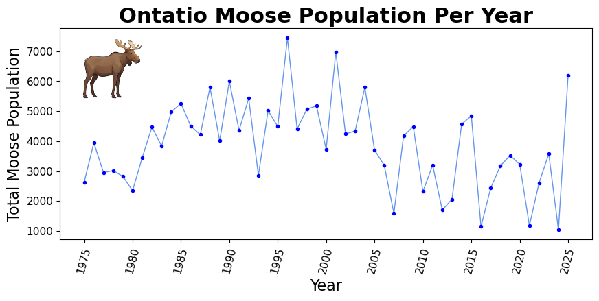
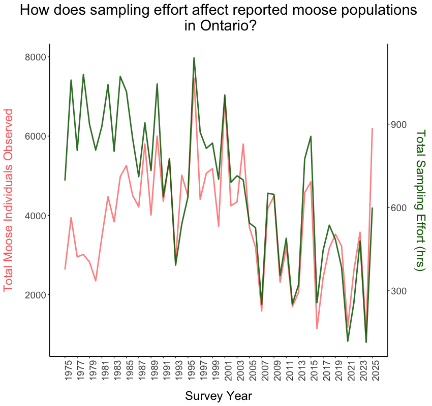

# Data Visualization

## Assignment 3: Final Project

### Requirements:
- We will finish this class by giving you the chance to use what you have learned in a practical context, by creating data visualizations from raw data. 
- Choose a dataset of interest from the [City of Toronto’s Open Data Portal](https://www.toronto.ca/city-government/data-research-maps/open-data/) or [Ontario’s Open Data Catalogue](https://data.ontario.ca/). 
- Using Python and one other data visualization software (Excel or free alternative, Tableau Public, any other tool you prefer), create two distinct visualizations from your dataset of choice.  
- For each visualization, describe and justify: 

**First Visualization using matplotlib in python:**
    

    
> What software did you use to create your data visualization?

I used python and the package matplotlib to produce the above visualization.

> Who is your intended audience? 

My target audience is the Ontario public perhaps at a park or nature reserve
    
> What information or message are you trying to convey with your visualization? 
    
In this visualization, I am trying to depict how moose populations have changed through the years in Ontario particularly from the 1990s to the early 2020s where there appears to be a downward trend.
    
> What aspects of design did you consider when making your visualization? How did you apply them? With what elements of your plots? 

When designing this visualization, I focused mostly on creating a simple and clear figure with limited design elements that would distract and confuse the viewer. With this goal in mind, I used large sans-serif fonts and removed extraneous graph figures (e.g. gridlines) to make a "concise composition" (versus "a detailed composition" as it was described in class) that would limit cognitive load for the viewer. I also utilized the color channel to differentiate between the discrete moose population values of each year shown as points and the trend line showing how the population has changed generally over time. I used luminance to distinguish between these features, but kept them both as shades of blue to depict that they are intimately connected (making use of the Gesault principle of similarity).
    
> How did you ensure that your data visualizations are reproducible? If the tool you used to make your data visualization is not reproducible, how will this impact your data visualization? 

To ensure that this visualization was reproducible, I included all of the raw data, the processed data, the R script used to process the data and the python script used to produce this visualization with my submission so that anyone interested could recreate the visualization themselves. 
    
> How did you ensure that your data visualization is accessible? 

To make this visualization accessible I utilized large font sizes and a sans-serif font style to ensure that viewers could read all the labels easily and to limit cognitive load. I also used limited color in this plot so that individuals with different types of color blindness would still be able to understand the different features. Finally, I included a small image of a moose on the graph so that individuals who do not speak English or who cannot read might still be able to infer what is being depicted on the graph. 
    
> Who are the individuals and communities who might be impacted by your visualization? 

This figure is intended for the general Ontario public so it would impact this group by providing them with more information about local moose populations. If the message from this graph inspires greater public advocacy for moose conservation, this visualization could, in turn, impact conservation scientists and policy makers in Ontario.
    
> How did you choose which features of your chosen dataset to include or exclude from your visualization? 
    
For this visualization, I wanted to create a relatively simple figure that would be understandable to the general public even for individuals who do not come from a science background. As such, I choose total moose population and year as my variables as they are easy to comprehend and connect with each other. Because the original dataset contained raw counts of moose populations from multiple sites in each year, I processed the data to produce a single total population for each year for all of Ontario. Completing this step allowed me to give the viewer a global snapshot of how total moose population changes with time in the province which is much more intuitive than a jumble of raw data points.

> What ‘underwater labour’ contributed to your final data visualization product?

Examples of 'underwater labour' that contributed to this data visualization include field technicians that completed the moose population counts throughout the years as well as various specialized personal that contributed to these efforts (e.g. drivers, helicopter pilots etc.), data technicians that update and maintain the moose population dataset and the individuals that wrote the matlibplot coding library that I utilized during data visualization. 

**Second Visualization using ggplot in R Programming:** 

> What software did you use to create your data visualization?

I used R progamming and the ggplot2 package to create the above visualization. 

> Who is your intended audience? 

My intended audience are conservation scientists and policy makers that design programs meant to balance moose harvest with moose conservation in Ontario.
    
> What information or message are you trying to convey with your visualization? 

The message that I am trying to convey with this visualization is that the total reported moose population in Ontario per year is very closely correlated with the total number of hours spent sampling moose per year (i.e. the sampling effort). Because of this relationship, it is possible that trends observed in moose populations over time (increasing, decreasing, etc.) may not accurately represent what is happening demographically. 
    
> What aspects of design did you consider when making your visualization? How did you apply them? With what elements of your plots? 

When designing this visualization, I considered a few things. First, I considered what channels I could use to help the reader differentiate between the two variables I plotted (total moose population and sampling effort) against time. Color was the most obvious choice and the effectiveness principle suggests that it is one of the better options when trying to separate two categorical elements. I also carried these colours into the axis titles to better link the variables with their respective lines using the Gestalt principle of similarity. Next, I considered how I could reduce cognitive load for my viewer by simplifying the plot and removing  extraneous visual elements. For example, I used a sans-serif font and removed gridlines and unnecessary axis elements to make the plot as visually simple as possible. 
    
> How did you ensure that your data visualizations are reproducible? If the tool you used to make your data visualization is not reproducible, how will this impact your data visualization?

As with the first plot, I ensured that this visualization was reproducible by including the raw data, the processed data and the R scripts used to process the data and to produce this visualization with my assignment so that this visualization can be recreated by anyone who wishes to. 
    
> How did you ensure that your data visualization is accessible? 

To make this visualization more accessible I did a few different things. First, for the line colours  included in my graph, I chose red and green which we learned in class were the two colours that were most easily distinguished. I also made sure that one of my lines (the dark green one) had a higher luminance than the other line so that an individual with complete colour blindness would still be able to tell the lines apart as one will appear dark and the other will appear lighter. Next, I utilized a large sans-serif font in all my titles and axis labels and removed all extraneous features from the graph (e.g. gridlines) to decrease the cognitive load of my viewers. 
    
> Who are the individuals and communities who might be impacted by your visualization? 

Conservation scientists and policy makers could be impacted by my visualization if they need to adjust policies, conservation/harvest programs and how they determine moose demographics based on the shown relationship between total observed moose and sampling effort. As well, if these changes lead to reductions in moose harvest, general hunters and the tourism industry for sport hunting in Ontario could be affected. 

> How did you choose which features of your chosen dataset to include or exclude from your visualization? 

From my work in ecology and evolutionary biology, I know that sampling effort can have a large effect on total population counts and often needs to be accounted for in statistics. When I downloaded the data, I noticed that both yearly moose population counts and sampling effort were included and was curious whether the relationship I had seen in my own work would also exist in this provincial dataset. As mentioned above, I processed the data which contained information from multiple sampling sites for each year to produce a single total population and sampling effort per year for all of Ontario in order to make the dataset more digestible.

> What ‘underwater labour’ contributed to your final data visualization product?

The examples of 'underwater labour' that I listed for the previous graph would also apply for this graph. Here, I would also include the individuals who wrote the ggplot2 package which I utilized to produce my data visualization.

- This assignment is intentionally open-ended - you are free to create static or dynamic data visualizations, maps, or whatever form of data visualization you think best communicates your information to your audience of choice! 
- Total word count should not exceed **(as a maximum) 1000 words** 
 
### Why am I doing this assignment?:  
- This ongoing assignment ensures active participation in the course, and assesses the learning outcomes: 
* Create and customize data visualizations from start to finish in Python
* Apply general design principles to create accessible and equitable data visualizations
* Use data visualization to tell a story  
- This would be a great project to include in your GitHub Portfolio – put in the effort to make it something worthy of showing prospective employers!

### Rubric:

| Component         | Scoring  | Requirement                                                                 |
|-------------------|----------|-----------------------------------------------------------------------------|
| Data Visualizations | Complete/Incomplete | - Data visualizations are distinct from each other - Data visualizations are clearly identified - Different sources/rationales (text with two images of data, if visualizations are labeled) - High-quality visuals (high resolution and clear data) - Data visualizations follow best practices of accessibility |
| Written Explanations | Complete/Incomplete | - All questions from assignment description are answered for each visualization - Explanations are supported by course content or scholarly sources, where needed |
| Code              | Complete/Incomplete | - All code is included as an appendix with your final submissions - Code is clearly commented and reproducible |

## Submission Information

🚨 **Please review our [Assignment Submission Guide](https://github.com/UofT-DSI/onboarding/blob/main/onboarding_documents/submissions.md)** 🚨 for detailed instructions on how to format, branch, and submit your work. Following these guidelines is crucial for your submissions to be evaluated correctly.

### Submission Parameters:
* Submission Due Date: `23:59 - 09/05/2025`
* The branch name for your repo should be: `assignment-3`
* What to submit for this assignment:
    * A folder/directory containing:
        * This file (assignment_3.md)
        * Two data visualizations 
        * Two markdown files for each both visualizations with their written descriptions.
        * Link to your dataset of choice.
        * Complete and commented code as an appendix (for your visualization made with Python, and for the other, if relevant) 
* What the pull request link should look like for this assignment: `https://github.com/<your_github_username>/visualization/pull/<pr_id>`
    * Open a private window in your browser. Copy and paste the link to your pull request into the address bar. Make sure you can see your pull request properly. This helps the technical facilitator and learning support staff review your submission easily.

Checklist:
- [ ] Create a branch called `assignment-3`.
- [ ] Ensure that the repository is public.
- [ ] Review [the PR description guidelines](https://github.com/UofT-DSI/onboarding/blob/main/onboarding_documents/submissions.md#guidelines-for-pull-request-descriptions) and adhere to them.
- [ ] Verify that the link is accessible in a private browser window.

If you encounter any difficulties or have questions, please don't hesitate to reach out to our team via our Slack. Our Technical Facilitators and Learning Support staff are here to help you navigate any challenges.
